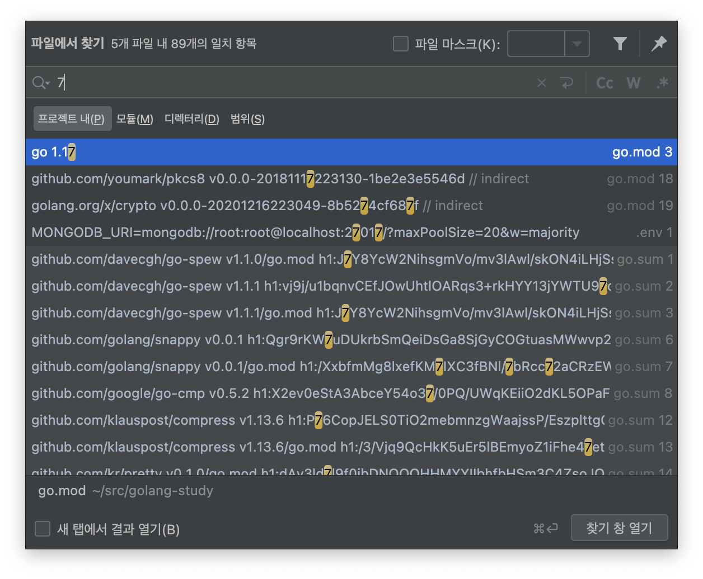

# 의미있는 이름

## 의도를 분명히 밝혀야 합니다.

```go
var d int // 경과 시간 (단위: 날짜)
```

보다는

```go
var elapsedTimeInDays int
var daysSinceCreation int
var daysSinceModification int
var fileAgeInDays int
```

이렇게 의도가 드러나는 이름을 사용하면 이해가 쉽습니다.

## 의미있게 구분해야 합니다.

- 컴파일러나 인터프리터만 통과하려는 생각으로 코드를 구현하면 안 됩니다.

연속적인 숫자를 덧붙인 이름 a1, a2... 는 딱 봐도 뭔 의미인지 모르겠습니다.

읽기 좋은 코드는 아니란 말이죠.

```go
func copyChar(a1 []byte, a2 []byte) {
	for i := range a1 {
		a2[i] = a1[i]
	}
}
```

책에서는 a1, a2 대신 source와 destination을 사용하면 의미가 분명해진다고 예시를 들었습니다.

```go
func copyChar(source []byte, destination []byte) {
	for i := range source {
		destination[i] = source[i]
	}
}
```

## 불용어는 안 쓰는게 좋습니다.

책에서는 ProductInfo 등으로 예시를 들었습니다.

UserInfo 나 UserData 도 마찬가지로 둘의 차이는 

UserInfo 유저의 정보 (연락처, 이름, 이메일 등) 

UserData 유저의 자료 정도로 생각해볼 수도 있겠지만,

딱 봤을 때, 차이가 확 와닿진 않은 것 같습니다.

그리고 책에서는

getActiveAccount(), getActiveAccounts(), getActiveAccountInfo() 라는 함수가 있다고 예시로 들었는데

앞에 두 개는 단수, 복수로 어느정도 짐작이 가능하지만, getActiveAccountInfo() 같은 걸 보면 구분이 안 될 수도 있겠네요.

이런 건 봐도 즐겁지 않으니, 나쁜 코드겠군요.

## 검색하기 쉬운 이름을 사용합시다.

MAX_CLASSES_PER_STUDENT 는 젯브레인사의 command + shift + f 커맨드로 찾기 쉽습니다.

하지만 숫자 7은 검색하면 힘들죠



## 이름 길이는 범위 크기에 비례해야 합니다.

얼마전 golang 컨퍼런스에서 베어로보틱스의 염재현님에게 변수명 질문이 있었는데,

스코프에 따라 다르다고 했던 기억이 있습니다.

이 책에서도 간단한 메서드에서 로컬 변수만 한 문자로 사용한다고 나왔는데

범위가 크면 클 수록 구분해야 할 부분이 많다보니 어떻게 보면 당연한 것 같습니다.

## 인코딩을 피합시다.

요즘 사람들이 쓰는 언어는 대부분 타입을 강력하게 검사합니다. (자바스크립트는 빼고요)

그래서

```go
var ageInt int
var addressString string
```

이런식으로 쓸 필요가 없단 얘기죠.

## 클래스 이름은 명사나 명사구가 좋습니다.

`Manager`, `Processor`, `Data`, `Info` 같은 단어는 피하고, 동사는 사용하지 않습니다.

## 메서드 이름은 동사나 동사구가 좋습니다.

`getProducts()` 나 `save()` 등이 좋은 예입니다.

go 에서는 접근자, 변경자, 조건자는 관례에 따라 (아닐 수도 있음) 

`Id()`, `SetId()`, `IsNil()` 등으로 표현할 수 있습니다.

## 기발한 이름은 피해야 합니다.

`delete()` 라는 함수를 `bomb()` 같은 느낌으로 쓰는 건 좋지 않습니다.

이런 나만 알 것 같은 이름보단 명료한 이름을 선택하는 게 좋습니다. 

## 말장난을 하면 안 됩니다.

여러 클래스에 `add` 라는 메서드가 있고 이 메서드는 기존 값 두개를 더하거나 이어서 새로운 값을 만든다고 가정했을 때,

새로 작성할 메서드는 슬라이스에 값을 하나 추가합니다.

이 때 `add` 를 쓰지 말고 `insert` 나 `append` 가 적당합니다.

## 의미 있는 맥락을 추가합시다.

그냥 아래 코드의 메서드를 훑어서는 변수의 의미가 불분명합니다.

```go
func printGuessStatistics(candidate byte, count int) {
	var number string
	var verb string
	var pluralModifier string

	if count == 0 {
		number = "no"
		verb = "are"
		pluralModifier = "s"
	} else if count == 1 {
		number = "1"
		verb = "is"
		pluralModifier = ""
	} else {
		number = strconv.Itoa(count)
		verb = "are"
		pluralModifier = "s"
	}

	fmt.Printf("There %s %s %s%s\n", verb, number, string(candidate), pluralModifier)
}
```

아래 코드로는 `GuessStatisticsMessage` 구조체 타입 변수를 만들었기 때문에 

`GuessStatisticsMessage` 에 속한다는 느낌을 줍니다.

즉 맥락이 분명해집니다.

이렇게 맥락을 개선하면 함수를 쪼개기 쉬워지고, 알고리즘도 명확해집니다.

```go
type GuessStatisticsMessage struct {
	number         string
	verb           string
	pluralModifier string
}

func (m *GuessStatisticsMessage) Make(candidate byte, count int) string {
	m.createPluralDependentMessageParts(count)
	return fmt.Sprintf("There %s %s %s%s\n", m.verb, m.number, string(candidate), m.pluralModifier)
}

func (m *GuessStatisticsMessage) createPluralDependentMessageParts(count int) {
	if count == 0 {
		m.thereAreNoLetters()
	} else if count == 1 {
		m.thereIsOneLetters()
	} else {
		m.thereAreManyLetters(count)
	}
}

func (m *GuessStatisticsMessage) thereAreManyLetters(count int) {
	m.number = strconv.Itoa(count)
	m.verb = "are"
	m.pluralModifier = "s"
}

func (m *GuessStatisticsMessage) thereIsOneLetters() {
	m.number = "1"
	m.verb = "is"
	m.pluralModifier = ""
}

func (m *GuessStatisticsMessage) thereAreNoLetters() {
	m.number = "no"
	m.verb = "are"
	m.pluralModifier = "s"
}
```

## 그래서 결론은..

이름을 바꾸는 데 두려워하지 맙시다.

그렇다고 기존에 괜찮은 이름까지 다 바꿔버리진 맙시다.

