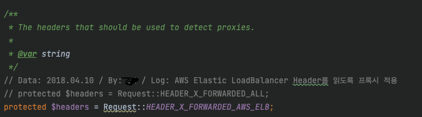
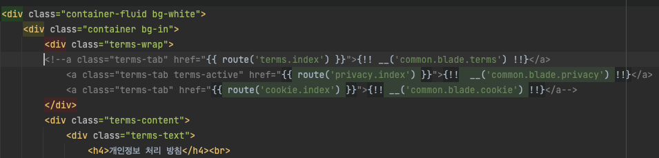

# 주석

> 잘 달린 주석은 좋지만 근거 없는 주석은 코드를 이해하기 어렵게 만듭니다.

- 주석은 코드로 의도를 표현하지 못해 사용하는 겁니다.
- 주석은 오래될수록 코드에서 멀어집니다.

## 의도가 정확하다면, 주석은 필요가 없습니다.

**회사 소스코드중 일부**

⚠️ 400줄이 넘는 함수의 일부입니다.

⚠️ 아래 내용은 100줄 입니다.
 

```php
    // 파트너 승인 바우처 중 b2b 후불 주문이 아닌 경우에 메일 발송
    if ($orderDetailInfo->type == 4 && (!in_array($booking->order_refer_type, ["B2", "BA2"]))) {
        if (!in_array($booking->order_refer_type, ["O1", "OW1"])) {
            ...
        } else {
            try { ... } catch (Exception $e) {
                $this->loggingError(...)
            }
        }
    }
```

이 코드의 문제는 일단

- 주석과 구현 내용이 다릅니다.
- 저 주석이 맞는 지 확인하려면 100줄을 읽어야 합니다
- 수정을 하면 주석에도 수정한 내용을 업데이트해야 합니다.

만약 여기서 특정 조건이 추가로 달린다면? 🤯

```php
    // 파트너 승인 바우처 중 b2b 후불 주문이 아닌 경우에 특정 국가에 메일 발송
    if ($orderDetailInfo->type == 4 
        && (!in_array($booking->order_refer_type, ["B2", "BA2"]))
        && (!in_array($booker->nationality->uid, [118, 119])
    ) {
        if (!in_array($booking->order_refer_type, ["O1", "OW1"])) {
                ...
        } else {
            try { ... } catch (Exception $e) {
                $this->loggingError(...)
            }
        }
    }
```

이렇게 되겠죠...?

점점 읽기 어려워지고 있는데요..

책에서 나온 내용을 참고해서 php 환경에서 수정한다면, 아래 코드처럼 수정할 수 있을 것 같습니다. 

```php
    const NORTH_KOREA = 118;
    const SOUTH_KOREA = 119;

    ... 

    if (
        $order->isCanceled() && 
        $booking->isB2BBooking() && 
        $booker->nationalityIsNotIn([NORTH_KOREA, SOUTH_KOREA])
    ) {
        $this->sendCancelMail($order)
    }
```

## 좋은 주석

좋은 주석도 있다고 합니다.

### 법적인 주석

메서드나 변수명에 이런 저작권 정보를 담기엔 어려울 수 있다고 생각합니다.

주석에 쓰는 것이 더 좋다고 생각됩니다.

```go
// Copyright 2011 The Go Authors. All rights reserved.
// Use of this source code is governed by a BSD-style
// license that can be found in the LICENSE file.

package build
```

### 정보를 제공하는 주석

기본적인 정보를 주석으로 제공하면 좋다고 설명하는데

개인적으로 애매하다고 생각되는 내용입니다.

함수 이름을 결정하고, 주석이 필요하다 싶으면 주석을 작성하고

그리고 주석의 내용을 함수 이름에 넣을 수 있다면 주석을 쓰지 않는 것이 좋아보입니다.

### 의도를 설명하는 주석

코드의 동작 자체를 코드로 표현할 수 있지만,

작성자의 의도를 코드로 표현하기엔 부족할 수 있다고 생각합니다.

하지만 개인적으로는 커밋 메시지에 쓸 수도 있다 생각합니다.

### 사람이 놓칠 수 있는 정보를 담은 경우

경고를 하거나 강조하고싶은 부분은 메서드나 함수명으로 표현하기 어렵습니다.

협업자에게 결과를 경고하는 목적으로 주석을 사용하는 경우,

중요성을 강조하는 주석은 허용합니다.

### TODO

프로그래머가 당장 구현하기 어려운 업무를 기술합니다.

하지만 TODO로 가득 채운 코드는 쫌 그렇습니다.

## 나쁜 주석

### 코드를 설명하는 주석

이 책에서는 코드를 짤 때 동작 방식을 직관적으로 해석할 수 있게하는 방법을 알려줍니다.

코드가 곧 실행해야 할 작업의 정이라는 의미입니다.

그래서 코드가 돌아가는 방식을 함수나 변수로 표현할 수 있다면

주석에 쓸 필요가 없습니다.

```go
// 숫자 두개를 더합니다
func add(a int, b int) {
	return a + b
}
```

### 의무적으로 다는 주석

javadocs 자매품 PHPDoc 이 있는데

PHPSTORM IDE 에서 안쓰면 경고를 줘서 항상 써왔지만..

보여주지 않을 변수인 경우에는 코드를 더럽힐 뿐이라고 합니다.

### 주석으로 커밋을 하는 경우

이런건 커밋 메시지도 남겨도 좋을 것 같습니다.

(근데 가끔 이런 주석이 도움이 되는 경우도 있더라구요)



### 위치를 표현하는 주석

아래 예시같은 걸 하지 말라는 것 같습니다.

```go
// --------- 데이터 가져오기 Start ----------

data := getData()

// --------- 데이터 가져오기 End ----------
```

### HTML 주석

🫣 네 그냥 지우는 게 더 좋은 것 같습니다..




