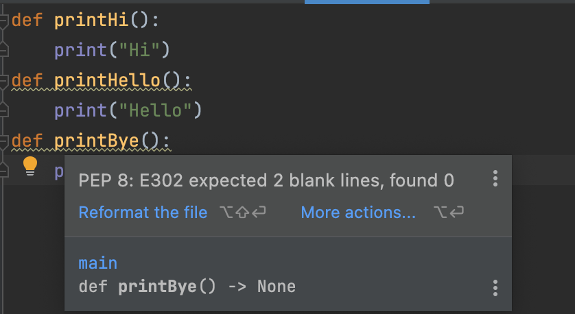
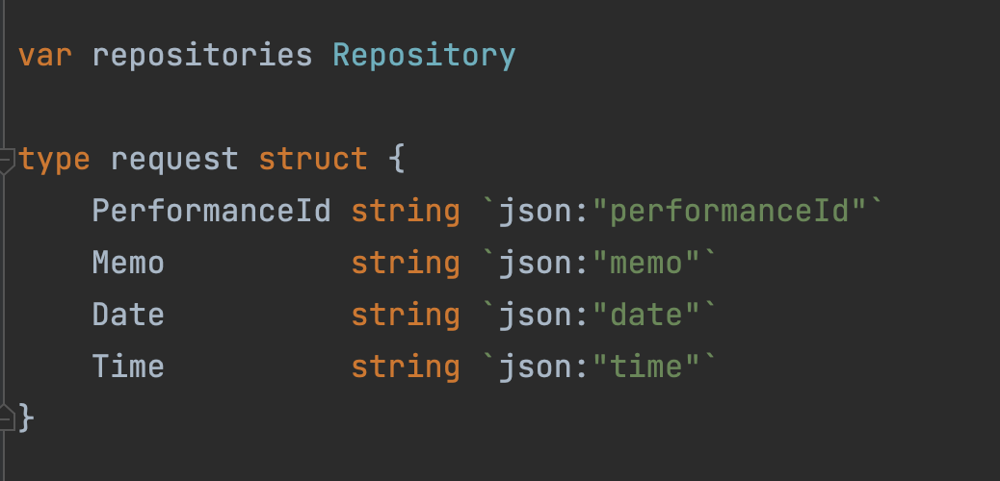
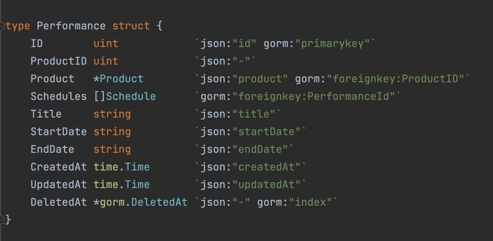

# 형식 맞추기

## 형식을 맞추는 목적?

- 코드의 가독성을 높이기 위해서
- 방도 예쁘게 정리해놓으면 보기 좋으니까 코드도 예쁘게 정리하면 보기 좋을 듯 해요

## 적절한 행 길이를 유지합시다

파일 크기는 200줄을 넘기지 않는게 좋을 것 같습니다.

## 개념은 빈 행으로 구분합시다.

IDE에서는 이렇게 함수를 붙여서 선언하면 경고를 줍니다.

`option + command + l` 만 눌러주면 해결되는 문제입니다.



## 변수 선언

변수는 사용하는 위치에 최대한 가까이 선언합니다.

회사 소스중에 정말 괜찮은 예시가 있지만, 너무 길어서 생략하겠습니다.

## 인스턴스 변수

보통 코드의 맨 앞에 인스턴스를 선언한다고 합니다.

네.. 앞이든 뒤든 인스턴스 변수는 모아서 선언하는 것이 좋다고 합니다.

찾기 어려우니까요~

Golang에는 클래스가 없습니다 

이런 걸 생각하지 않아도 상관 없습니다.

## 종속 함수

한 함수가 특정 함수를 호출할 때는 두 함수는 세로로 가까이 배치돼있는 게 좋습니다.

## 개념적 유사성

개념적인 친화도가 높다면 가까이 배치하는 것이 좋습니다.

얼마전 코드를 짜면서 괜찮은 예시가 있는 것 같아 첨부합니다

```go
package s3

...

func (s3 S3Config) UploadFile(file io.Reader, path string, fileExtension string) error {
    ...
    s3.upload(file, key)
    ...
}

func (s3 S3Config) upload(file io.Reader, key string) error {
    ...
    s3Object := &s3.PutObjectInput{
		Bucket: aws.String(s.bucket),
		Key:    aws.String(key),
		Body:   file,
	}
    ...
}

func (s3 S3Config) DownloadFile(path string, file io.Writer) error {
    ...
    s3.download(key, file)
    ...
}

```

## 가로 형식 맞추기

- 한 줄에 120자는 넘지 맙시다
- 20 ~ 60자 사이로 쓰려고 하는 게 좋을 듯 합니다.

## 가로 공백과 밀집도

```go
func (c *CodeAnalyzer) measureLine(line string) {
    lineCount += 1
    lineSize := len(line) // 할당 연산자를 강조하기 위해 앞 뒤에 공백을 줌  
    c.TotalChars += lineSize
    lineWidthHistogram.addLine(lineSize, lineCount) // 함수와 이어지는 괄호 사이에는 넣지 않음  
    recordWidestLine(lineSize)
}
```

## 가로 정렬

여러 언어 C, C++, Java 등은 가로 정렬을 안 하는게 좋다고 합니다.

아래의 코드처럼 클래스 선언부가 길다면 클래스를 쪼개는 것이 더 좋습니다.

```java
public class FitNesseExpediter implements ResponseSender
{
    private Socket socket;
    private InputStream input;
    private OutputStream output;
    private StringBuilder response;
    private StringBuilder request;
    private StringBuilder requestPath;
    private StringBuilder requestQueryString;
    private long requestStartTime;
    private long requestEndTime;
    private boolean requestComplete;
    ...
}
```

## gofmt

하지만 Golang에는 `gofmt`가 있죠. 👍





## 들여쓰기

소스코드에 들여쓰기가 없다면, 해독하기 정말 어렵습니다.

특히 파이썬은 괄호가 없이 스페이스바로 들여쓰기를 제대로 하지 않으면 오류라고 말해주는 좋은 언어같습니다.

```python
def main():
    if is_okay:
        print("okay")
    if is_good: # 오류!
    print("good")
    print('hello')
```

## 들어쓰기 무시하기

저도 제가 코드를 쓰는 동안 위의 코드가 더 간결한데? 이걸로 써야겠다 라고 생각했지만,

제가 다시 코드를 볼 때 아래 코드가 더 보기 편하다는 걸 자주 느낍니다.

책에서는 이걸 유혹이라고 표현했는데 적절한 것 같습니다.

```php
if ($myImage) return $myImage;
else return $defaultImage;
```

```php
if ($myImage) {
    return $myImage;
} else {
    return $defaultImage;
}
```

## 팀 규칙

정해진 규칙이 있다면, 아무리 좋은 스타일이 있더라도 규칙을 따르는 것이 좋습니다.

코드를 읽는 데 전체적인 통일감도 중요하기 때문입니다.
