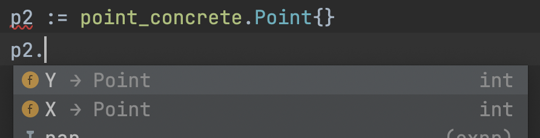

# 객체와 자료 구조

## 자료 추상화

다음 예시는 Point의 구조체입니다.

```go
package point_concrete

type Point struct {
	X int
	Y int
}
```

아래 사진처럼 해당 패키지 밖에서도 Point 구조체의 요소를 읽거나, 수정할 수 있습니다.



그리고 아래 코드는 외부에서 접근할 수 없도록 구조체를 숨기고, 인터페이스를 구현해줬습니다. 

```go
package point

type Point interface {
	X() int
	Y() int
	R() int
	Theta() int
	SetCartesian(x, y int)
	SetPolar(r, theta float64)
}

// go 에서는 이름의 앞 글자가 대문자면 public 입니다.
// 반대로 소문자라면 private 입니다.
type point struct {
	x     int
	y     int
	r     int
	theta int
}

func New() Point {
	return &point{0, 0, 0, 0}
}
```

그래서 point 패키지 밖에서는 point 의 요소에 접근할 수 없고,

인터페이스로 구현한 메서드만 허용하게 됩니다.

x와, y 좌표를 각각 설정하는 것을 막고, 좌표를 설정할 때는 한꺼번에 설정해야하도록 강제했습니다.

```go
package main

import (
	"{MY_MODULE}/point"
	"fmt"
)

func main() {
	p := point.New()
	p.SetCartesian(2, 2)
	p.SetPolar(3, 4)
	fmt.Println(p.X(), p.Y(), p.R(), p.Theta())
}
```

### 구현을 감추려면 추상화가 필요합니다.

형식 논리에 치우쳐 `Getter`와 `Setter` 롤 도배를 한다고 해서 클래스가 되는 게 아닙니다.

그보다는 추상 인터페이스를 제공해 사용자에게 구현을 숨기는 것이 진정한 의미의 클래스라고 할 수 있습니다.

## 자료/객체 비대칭

다음은 절차 지향적 프로그래밍의 예시입니다.

`Area()` 메서드를 실행하면 인수로 받은 `shape` 의 타입을 검사합니다.

절차적인 코드는 기존 자료 구조를 변경하지 않으면서 새 함수를 추가하기 쉽습니다.

반면에 자료 구조를 변경하기 어렵습니다.

자료 구조를 변경하기 위해 모든 메서드를 고쳐야할 수도 있습니다.

```go
const PI = 3.141592653589

type Square struct {
	topLeft point.Point
	side    int
}

type Rectangle struct {
	topLeft point.Point
	height  int
	width   int
}

type Circle struct {
	center point.Point
	radius int
}

type Geometry struct {
	
}

func (g *Geometry) Area(shape any) int {
	switch shape.(type) {
	case *Square:
		s := shape.(*Square)
		return s.side * s.side
	case *Rectangle:
		r := shape.(*Rectangle)
		return r.height * r.width
	case *Circle:
		c := shape.(*Circle)
		return int(float64(c.radius) * float64(c.radius) * PI)
	}

	return 0
}
```

다음은 객체 지향적인 프로그래밍의 예시입니다.

새 함수를 추가하기 어렵습니다.

예를 들어 `Height()` 를 구하는 메서드를 인터페이스에서 구현한다고 하면,

모든 도형에 `Height()` 메서드를 추가해야하는 상황이 일어납니다.

```go
type Shape interface {
	Area() int
}

type Square struct {
	topLeft point.Point
	side    int
}

func (s *Square) Area() int {
	return s.side * s.side
}

type Rectangle struct {
	topLeft point.Point
	height  int
	width   int
}

func (r *Rectangle) Area() int {
	return r.height * r.width
}

type Circle struct {
	center point.Point
	radius int
}

func (c *Circle) Area() int {
	return int(float64(c.radius) * float64(c.radius) * 3.14)
}
```

> 때로는 단순한 자료구조와 절차적인 코드가 적합한 상황도 있습니다.

## 디미터 법칙

디미터 법칙은 모듈은 자신이 조작하는 객체의 속사정을 몰라야 한다는 법칙입니다.

디미터 법칙은 "클래스 C의 메서드 f는 다음과 같은 객체의 메서드만 호출해야 한다" 라고 주장합니다.

- 클래스 C
- f가 생성한 객체
- f 인수로 넘어온 객체
- C 인스턴스 변수에 저장된 객체

### 기차 충돌

다음과 같은 코드를 기차 충돌이라 부릅니다.

이 코드는 디미터 법칙을 어기고 있습니다.

`getOptions()` 가 반환하는 객체의 `getScratchDir()` 를 호출하고

`getScratchDir()` 가 반환하는 객체의 `getAbsolutePath()` 를 호출해서죠.

```java
final String outputDir = ctxt.getOptions().getScratchDir().getAbsolutePath();
```

기차 출돌 코드는 다음과 같이 변경하는 것이 좋습니다.

```java
 Options opts = ctxt.getOptions();
 File scratchDir = opts.getScratchDir();
 final String outputDir = scratchDir.getAbsolutePath();
```

### 구조체 감추기

그렇다면 디미터 법칙을 위반하지 않으려면 어떻게 해야 할까요?

책에서는 다음 두 가지의 코드가 나옵니다.

하지만 둘 다 객체가 하는 방식이 너무 투명합니다.

```java
// 임시 디렉토리 옵션의 경로를 가져와라 ...?
ctxt.getAbsolutePathOfScratchDirectoryOption();

// 임시 디렉토리 옵션중에서 절대 경로를 가져와라
ctx.getScratchDirectoryOption().getAbsolutePath()
```

그래서 이런 경우에는 이 코드의 사용 이유를 생각해야 합니다. 

근본으로 들어가서 왜 임시 디렉토리 경로를 가져와야하는지 알아야 합니다.

그리고 그 사용 목적을 파악하고 난 뒤에 적절하게 대응을 하는 것이 좋다고 설명합니다.

책에서는 임시 디렉토리를 가져오려는 이유가 임시 파일을 생성하기 위한 목적이라고 예시가 나오는데,

아예 ctxt 객체에 임시 파일을 생성하는 방식으로 풀어나갔습니다.

이렇게 되면 ctxt는 내부 구조를 드러내지 않고, 모듈에서는 여러 객체를 탐색할 필요가 없어집니다.

```java
BufferedOupputStream bos = ctxt.createScratchFileStream(classFileName);
```

## 자료 전달 객체

### DTO (Data Transfer Object)

공개 변수만 있고, 함수가 없는 클래스

### bean 구조

빈은 공개 변수를 `getter` 와 `setter` 로 조작합니다.

책에서는 사이비 캡슐화로 표현하고있고, 저도 인정합니다.

```java
public class Article {
    private String id
    private String postedAt
    private String title
    
    public Article(String id, String postedAt, String title) {
        this.id = id
        this.postedAt = postedAt
        this.title = title
    }
    
    public String getId() {
        return id
    }
    
    public String getPostedAt() {
        return postedAt
    }
    
    public String getTitle() {
        return title
    }
}
```

### 활성 레코드

- DTO의 특수한 형태입니다.
- `get()`, `set()` 말고도 `find()`, `save()`도 제공합니다.

하지만 이런 활성 레코드에 비즈니스 로직을 넣어선 안됩니다.

그렇게 되면 자료 구조도 아니고, 객체도 아닌 구조가 나오기 때문입니다.
