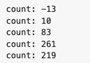

# 동시성

## 동시성이 필요한 이유

- 커플링을 없애기 위함
- 응답 시간/ 작업 처리량 개선

## 동시성에 대한 오해

### 동시성은 항상 성능을 높여준다

- 동시성은 때로는 성능을 높여주지만, 이는 조건이 있습니다.
- 대기 시간이 길어 여러 스레드가 프로세서를 공유할 수 있는 경우
- 여러 프로세서가 동시에 처리할 독립적인 계산이 충분히 많은 경우

### 동시성을 구현해도 설계는 변하지 않는다.

- 아닙니다. 무엇과 언제를 분리하면 시스템 구조가 크게 달라집니다.

## 동시성 특징

### 동시성은 다소 부하를 유발한다.

- 성능측에서 부하가 걸립니다 (컨텍스트 스위칭)

### 동시성은 복잡하다.

- 간단한 문제라도 동시성은 복잡합니다.

### 일반적으로 동시성 버그는 재현하기 어렵다.

- 10000번 9999번은 잘 돌아가지만 1번은 오류가 나는 경우도 있습니다.

## 난관

count라는 변수를 동시에 1을 더하고 빼는 작업을 10만번씩 했을 때

count는 0이 될 거라고 예상할 수 있겠지만

```go
package main

import (
	"fmt"
	"sync"
)

var count int = 0

func add(wg *sync.WaitGroup) {
	defer wg.Done()
	count++
}

func sub(wg *sync.WaitGroup) {
	defer wg.Done()
	count--
}

func con() {
	var wg sync.WaitGroup
	for i := 0; i < 100000; i++ {
		wg.Add(2)
		go add(&wg)
		go sub(&wg)
	}
	fmt.Println("count:", count)
}

func main() {
	for i := 0; i < 5; i++ {
		con()
	}
}
```

0은 나오지 않았습니다.



연산을 수행하는 도중에 다른 작업이 동시에 똑같은 연산을 해버렸기 때문에

count가 1000인 순간에 1000 + 1 을 2번 이상 한 겁니다

## 동시성 방어 원칙

### SRP

동시성은 복잡성 하나만으로도 분리할 이유가 충분합니다.

동시성을 구현할 때는 다음 몇 가지를 고려합니다.

- 동시성 코드는 독자적인 개발, 변경, 조율 주기가 있습니다.
- 동시성 코드는 독자적인 난관이 있습니다. 어렵습니다.
- 잘못 구현한 동시성 코드는 다양한 방식의 실패 케이스가 존재합니다.

### 따름 정리: 자료 범위를 제한하라

앞에 나온 예시처럼 동일한 필드를 수정하면서 원하는 결과가 나오지 않는 걸 방지하기 위해

객체를 사용하는 코드 내 **critical section**을 보호하라고 권장합니다.

### 따름 정리: 자료 사본을 사용하라

공유 자료를 줄이기 위해 처음부터 공유하지 않는 방법이 있습니다.

### 따름 정리: 스레드는 가능한 독립적으로 구현하라

자신만의 세상에 존재하는 스레드를 구현하세요.

다른 스레드와 자료를 공유하지 않는 게 좋습니다.

(독자적인 스레드로, 가능하면 다른 프로세서에서 돌려도 괜찮도록 자료를 독립적인 단위로 분할)

## 스레드 코드 테스트

### 권장사항

- 문제를 노출하는 테스트 케이스를 작성
- 프로그램 설정과 시스템 설정과 부하를 바꿔가며 자주 실행
- 테스트 실패시 원인 추적

### 말이 안 되는 실패는 잠정적인 스레드 문제로 취급하라

스레드 코드에는 극악의 확률로 등장하는 오류가 발생할 수 있습니다.

이런 걸 일회성 문제라고 하는데 무시하면 안되고 잘 고쳐야합니다.

### 다중 스레드를 고려하지 않은 순차 코드부터 제대로 돌게 만들자

스레드 환경 밖에서 생기는 버그와 스레드 환경에서 생기는 버그를 동시에 디버깅하지 않는게 좋습니다.

### 다중 스레드를 쓰는 코드 부분을 다양한 환경에 쉽게 끼워넣을 수 있게 스레드 코드를 구현하라

- 한 스레드로 실행하거나, 여러 스레드로 실행하거나, 실행 중 스레드 수를 바꿔본다.
- 스레드 코드를 실제 환경이나 테스트 환경에서 돌려본다
- 테스트 코드를 빨리, 천천히 다양한 속도로 돌려본다
- 반복 테스트가 가능하도록 테스트 케이스를 작성한다

### 다중 스레드를 쓰는 코드 부분을 상황에 맞게 조율할 수 있게 작성하라

스레드 개수를 조율하기 쉽게 코드를 구현하도록

### 프로세서 수보다 많은 스레드를 돌려보라

시스템이 스레드를 스와핑할 때도 문제가 발생합니다.

스와핑을 일으키려면 프로세서 수보다 많은 스레드를 돌립니다.

스와핑이 잦을수록 임계영역을 빼먹은 코드나 데드락을 일으키는 코드를 찾기 쉬워집니다.

### 코드에 보조 코드를 넣어서 돌려라, 강제로 실패를 일으키게 해보라

코드 중간중간에 무작위로 시간을 지연하거나 함수 호출 위치를 바꿔보는 방식으로 테스트를 하면

더 우아하게 동시성을 처리할 수 있습니다.
